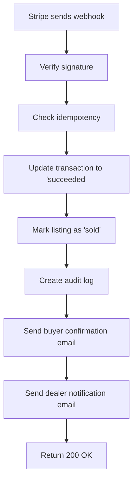
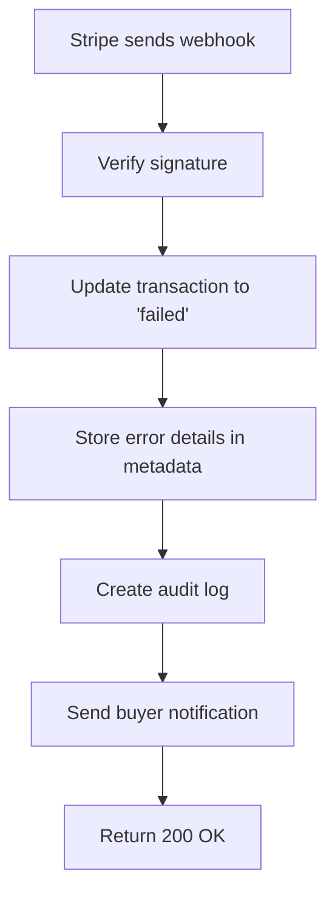
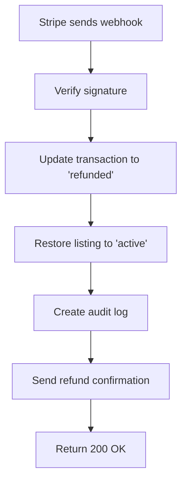

# Stripe Webhook Testing Guide

## Overview

The Stripe webhook endpoint handles payment lifecycle events and is **critical for production operations**. This guide covers local testing and production setup.

---

## 🔐 Security Features Implemented

- ✅ **Webhook signature verification** (prevents unauthorized requests)
- ✅ **Raw body parsing** (required for signature validation)
- ✅ **Idempotency checking** (prevents duplicate processing)
- ✅ **Comprehensive error handling**
- ✅ **Audit logging** for all events
- ✅ **Always returns 200** to Stripe (prevents retry storms)

---

## 📍 Endpoint

**URL:** `POST /api/stripe/webhooks`

**Authentication:** Stripe signature header (`stripe-signature`)

---

## 🧪 Local Testing with Stripe CLI

### 1. Install Stripe CLI

**Windows:**

```powershell
# Download from: https://github.com/stripe/stripe-cli/releases
# Or use Scoop:
scoop bucket add stripe https://github.com/stripe/scoop-stripe-cli.git
scoop install stripe
```

**Mac/Linux:**

```bash
brew install stripe/stripe-cli/stripe
```

### 2. Login to Stripe

```bash
stripe login
```

This will open a browser to authenticate with your Stripe account.

### 3. Forward Webhooks to Local Server

```bash
# Make sure your dev server is running on localhost:3000
npm run dev

# In a separate terminal, start webhook forwarding:
stripe listen --forward-to http://localhost:3000/api/stripe/webhooks
```

**Output:**

```
> Ready! You are using Stripe API Version [2025-11-17]. Your webhook signing secret is whsec_xxx (^C to quit)
```

**IMPORTANT:** Copy the `whsec_xxx` secret and add it to your `.env.local`:

```env
STRIPE_WEBHOOK_SECRET=whsec_your_secret_from_cli_here
```

### 4. Trigger Test Events

In another terminal, trigger specific events:

```bash
# Test successful payment
stripe trigger payment_intent.succeeded

# Test failed payment
stripe trigger payment_intent.payment_failed

# Test charge refund
stripe trigger charge.refunded
```

### 5. Monitor Webhook Processing

Watch your dev server logs to see:

```
[Webhook] Received webhook event
[Webhook] Signature verified: payment_intent.succeeded
[Webhook] Processing payment success: pi_xxx
[Webhook] Transaction updated: xxx
[Webhook] Listing marked as sold: xxx
[Webhook] Payment succeeded processing complete
```

---

## 🌐 Production Setup

### 1. Create Webhook Endpoint in Stripe Dashboard

1. Go to: https://dashboard.stripe.com/webhooks
2. Click **"Add endpoint"**
3. Enter your production URL:
   ```
   https://yourdomain.com/api/stripe/webhooks
   ```
4. Select events to listen to:
   - ✅ `payment_intent.succeeded`
   - ✅ `payment_intent.payment_failed`
   - ✅ `payment_intent.canceled`
   - ✅ `charge.refunded`
5. Click **"Add endpoint"**

### 2. Get Webhook Secret

After creating the endpoint:

1. Click on the webhook endpoint
2. Click **"Reveal"** under **Signing secret**
3. Copy the secret (starts with `whsec_`)

### 3. Update Production Environment Variables

Add to your production environment (e.g., Vercel):

```env
STRIPE_WEBHOOK_SECRET=whsec_your_production_secret_here
```

### 4. Test Production Webhook

In Stripe Dashboard:

1. Go to your webhook endpoint
2. Click **"Send test webhook"**
3. Select an event type
4. Click **"Send test webhook"**
5. Check the "Response" tab for 200 status

---

## 📊 Event Processing Flow

### Payment Success (`payment_intent.succeeded`)



**Database Changes:**

- `transactions.status` → `'succeeded'`
- `transactions.completed_at` → current timestamp
- `car_listings.status` → `'sold'`

**Notifications:**

- ✉️ Buyer: "Payment Confirmed"
- ✉️ Dealer: "New Vehicle Sale"

---

### Payment Failed (`payment_intent.payment_failed`)



**Database Changes:**

- `transactions.status` → `'failed'`
- `transactions.metadata` → error details

**Notifications:**

- ✉️ Buyer: "Payment Failed - Action Required"

---

### Refund (`charge.refunded`)



**Database Changes:**

- `transactions.status` → `'refunded'`
- `transactions.metadata` → refund details
- `car_listings.status` → `'active'` (available again)

**Notifications:**

- ✉️ Buyer: "Refund Processed"

---

## 🧪 Testing Checklist

### Local Development

- [ ] Stripe CLI installed and authenticated
- [ ] Webhook secret added to `.env.local`
- [ ] Dev server running (`npm run dev`)
- [ ] Stripe CLI forwarding active
- [ ] Test `payment_intent.succeeded` event
- [ ] Test `payment_intent.payment_failed` event
- [ ] Test `charge.refunded` event
- [ ] Verify database updates
- [ ] Check console logs for errors

### Production

- [ ] Webhook endpoint created in Stripe Dashboard
- [ ] Production webhook secret added to environment
- [ ] Test webhook with "Send test webhook" in Dashboard
- [ ] Monitor first real transaction
- [ ] Set up error alerting (e.g., Sentry)
- [ ] Configure email notifications
- [ ] Test refund flow with real transaction

---

## 🔍 Debugging

### Check Webhook Logs in Stripe Dashboard

1. Go to: https://dashboard.stripe.com/webhooks
2. Click on your webhook endpoint
3. View recent webhook attempts
4. Check response codes and body

### Common Issues

**400 Bad Request - Signature Verification Failed**

```
Solution: Ensure STRIPE_WEBHOOK_SECRET matches the endpoint secret
```

**Transaction not found**

```
Solution: Ensure payment intent was created through your API
Check that stripe_payment_intent_id is correctly stored
```

**Email not sending**

```
Solution: Implement email service integration (currently placeholder)
Use Resend, SendGrid, or your email provider
```

### Enable Detailed Logging

Check your application logs for:

```
[Webhook] Received webhook event
[Webhook] Signature verified: {event.type}
[Webhook] Processing {event_type}: {id}
[Webhook] Transaction updated: {transaction_id}
```

---

## 📧 Email Integration (TODO)

The webhook handler includes placeholder email functions. To enable:

### Option 1: Resend (Recommended)

```typescript
import { Resend } from "resend";

const resend = new Resend(process.env.RESEND_API_KEY);

async function sendEmail(params) {
  await resend.emails.send({
    from: "SK AutoSphere <notifications@skautosphere.com>",
    to: params.to,
    subject: params.subject,
    html: generateEmailTemplate(params.type, params.data),
  });
}
```

### Option 2: Existing Email Service

Update the `sendEmail` function in `route.ts` to use your email service from `/lib/email/`.

---

## 🚨 Security Best Practices

1. **Always verify webhook signatures** ✅ Implemented
2. **Use HTTPS in production** (automatically handled by Vercel/hosting)
3. **Keep webhook secret confidential**
4. **Monitor for unusual activity**
5. **Set up error alerting**
6. **Log all webhook events for audit trail** ✅ Implemented

---

## 📈 Monitoring

### Metrics to Track

- Webhook success rate (should be >99%)
- Average processing time
- Failed signature verifications (should be 0)
- Duplicate events (handled by idempotency)
- Email delivery success rate

### Recommended Tools

- **Stripe Dashboard**: Built-in webhook monitoring
- **Sentry**: Error tracking
- **Datadog/New Relic**: Performance monitoring
- **Supabase**: Database query performance

---

## 🔄 Webhook Retry Behavior

Stripe automatically retries failed webhooks:

- Initial retry: after 5 minutes
- Subsequent retries: exponential backoff up to 3 days
- **Important:** Always return 200 to acknowledge receipt

Our implementation:

- ✅ Returns 200 even for processing errors
- ✅ Logs errors for manual review
- ✅ Prevents retry storms with idempotency

---

## 📝 Event Handling Summary

| Event                           | Database Update | Listing Status | Emails Sent        |
| ------------------------------- | --------------- | -------------- | ------------------ |
| `payment_intent.succeeded`      | ✅ `succeeded`  | 🔒 `sold`      | 2 (buyer + dealer) |
| `payment_intent.payment_failed` | ✅ `failed`     | ⏸️ no change   | 1 (buyer)          |
| `payment_intent.canceled`       | ✅ `failed`     | ⏸️ no change   | 0                  |
| `charge.refunded`               | ✅ `refunded`   | 🔓 `active`    | 1 (buyer)          |

---

## 🎯 Next Steps

1. **Test locally** with Stripe CLI
2. **Implement email service** integration
3. **Deploy to production**
4. **Set up webhook endpoint** in Stripe Dashboard
5. **Monitor first transactions**
6. **Configure alerting** for failures

---

## 📚 Resources

- [Stripe Webhooks Guide](https://stripe.com/docs/webhooks)
- [Stripe CLI Documentation](https://stripe.com/docs/stripe-cli)
- [Webhook Security](https://stripe.com/docs/webhooks/signatures)
- [Testing Webhooks](https://stripe.com/docs/webhooks/test)
